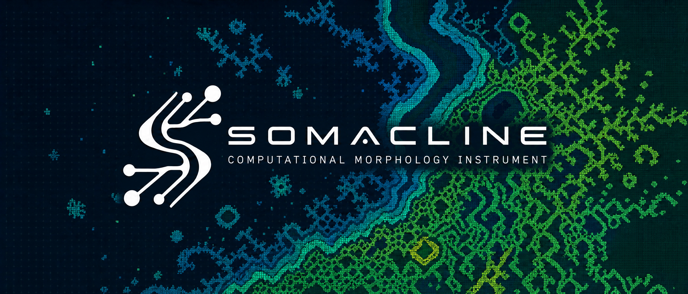
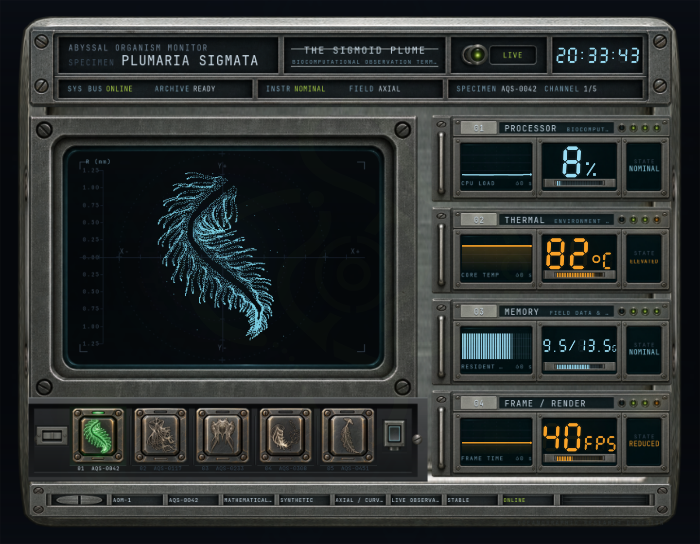
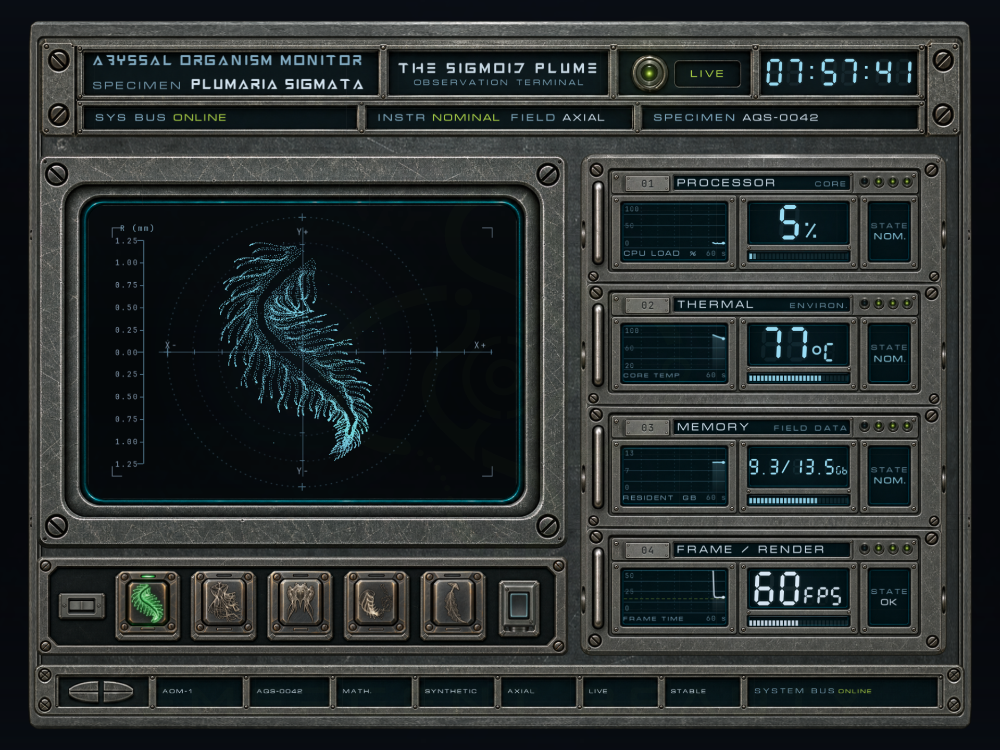
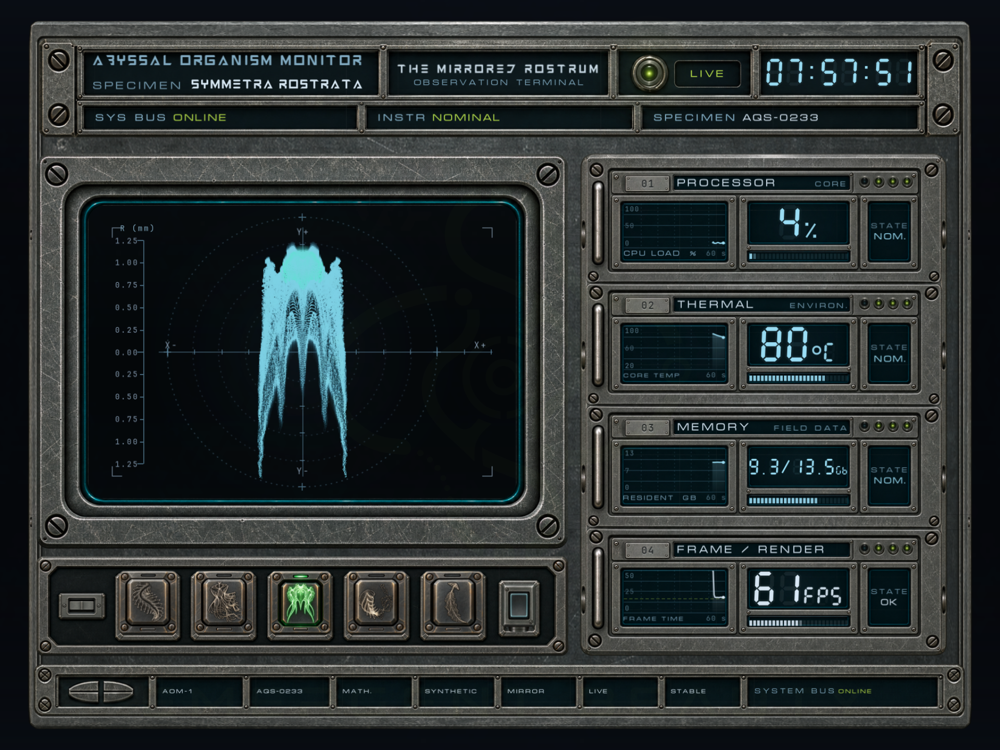
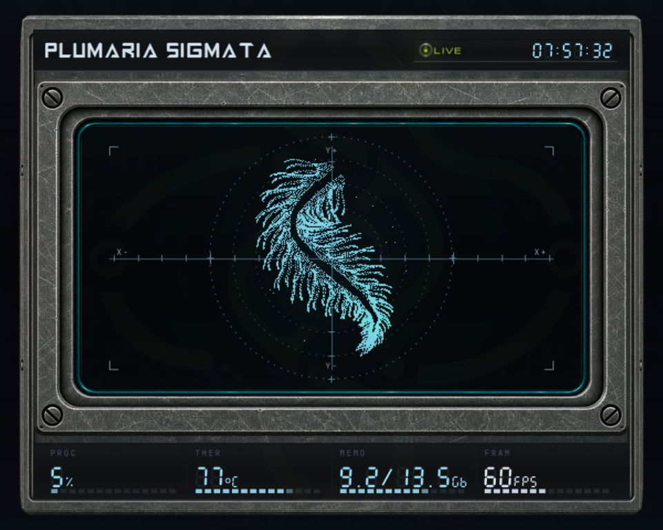
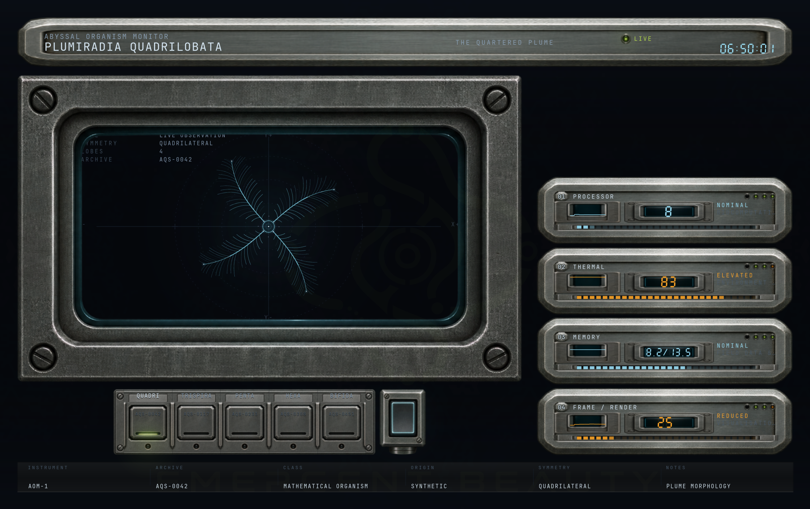
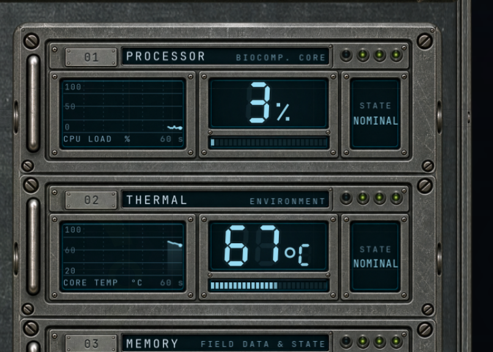
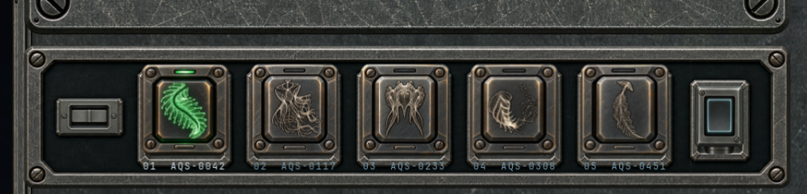

<div align="center">



[](rust/Cargo.toml) [](#linux-wayland-hyprland) [](#linux-wayland-hyprland) [](https://github.com/Ozymandes/SOMACLINE/releases/tag/v1.0.0) [](LICENSE) [](#architecture) [](#architecture) [](#performance)

</div>

**SOMACLINE** is a computational morphology instrument for Linux.

I built it because I wanted to know what a system monitor might look like
if, instead of another dashboard full of bars and sparklines, it looked like
a piece of scientific equipment from a future that never happened. I had
been spending far too much time thinking about computational biology,
artificial life and emergent morphology, and had recently fallen fairly deep
into Bruce Sterling's Shaper/Mechanist stories, especially *Swarm*. The
usual CPU graphs were beginning to feel like an enormous missed opportunity.

SOMACLINE puts five mathematical organisms behind the glass and lets the
machine interfere with them. It samples `/proc` and `/sys` at 5 Hz, then maps
CPU load, temperature, memory pressure and I/O into different bounded
behaviours for each specimen. The source equations remain recoverable
exactly at rest; the telemetry acts on their rendered morphology rather than
quietly replacing the mathematics with arbitrary animation.

The rest became a systems problem. The shipping build is Rust, `winit`,
`softbuffer`, Cairo and Pango. It renders entirely on the CPU, uses no GTK
or GPU path in the production host, runs with two threads, sits at roughly
46 MB PSS in the measured configuration, and follows compositor frame
callbacks closely enough that moving it to another workspace drops it to
about 0.12% of one core.

## Quick start

SOMACLINE is built for Linux and was developed and verified on Wayland.

```sh
git clone https://github.com/Ozymandes/SOMACLINE
cd SOMACLINE
./install.sh
somacline
```

`install.sh` builds the release binary and installs it into `~/.local`, and
warns if `~/.local/bin` is not on your `PATH`. On Arch and derivatives,
install the required system packages first:

```sh
sudo pacman -S --needed cairo pango fontconfig
```

To run directly from the checkout without installing:

```sh
./run-somacline.sh
```

For a system-wide installation, use `./install.sh --prefix /usr/local`. The
detailed Installation section below covers uninstalling and packaging,
Optional typography covers the display faces, Linux, Wayland, Hyprland covers
window behaviour, and Controls lists every key.

## What it is

Each specimen is a point cloud from one of [@yuruyurau's](https://x.com/yuruyurau)
published generative sketches. The equations are ported without changing
their variables, constants or operator order. The telemetry goes through a
smoothing and mapping layer called physiology, which transforms the *solved*
points, never the equation. CPU load can ripple down one body; I/O can pass
between the two bodies of another. Temperature can shear a normally mirrored
specimen, while memory pressure changes point density. With the physiology
drives set to zero, a test checks that every specimen returns to its source
geometry exactly.

Six generated modules make up the enclosure: shell, header, observation
chamber, telemetry rack, selector and status rail. Their recesses are
measured from the artwork so the live displays fit the metal. The
seven-segment numbers, 60-second graphs, lamps and clock are rendered in
code. No telemetry reading is baked into an asset.

<div align="center">

</div>

> The faceplate says `ABYSSAL ORGANISM MONITOR`. The status rail says `AOM-1`.
> The specimens have catalogue numbers. SOMACLINE is the software's name;
> the chassis has its own labels.

## The organisms

The five source sketches are by [@yuruyurau](https://x.com/yuruyurau).
Each uses a short p5.js equation evaluated thousands of times per frame. The
originals are preserved verbatim alongside the Rust ports in
[`rust/src/sources.rs`](rust/src/sources.rs); the first ports were in NumPy.

| # | Specimen | Form | Your machine reads as |
|---|---|---|---|
| 01 | **PLUMARIA SIGMATA** | a sigmoid plume | a ripple down the body |
| 02 | **DIPLOSOMA CONIUGATA** | two coupled bodies | I/O crossing between them |
| 03 | **SYMMETRA ROSTRATA** | a mirrored alien | heat breaking the mirror plane |
| 04 | **QUADRIPLUMA ARTICULATA** | four separate plumes | load desynchronising the four |
| 05 | **PENNARIA SOLITARIA** | a single feather | a whip growing toward the tip |

<div align="center">


</div>

The ports keep the originals' variable names, operator order and loop
bounds. Even a tidy-looking rewrite can change the output, so the equations
are left alone.

The mathematics is documented equation by equation in
[`docs/CREATURE_EQUATIONS.md`](docs/CREATURE_EQUATIONS.md) — every source
verbatim, the porting rules, and what was verified.

## System behaviour

SOMACLINE can stay open without continuing to render when the compositor
stops presenting its window. These are measurements on the release machine,
not fixed resource limits:

| state | what it does |
|---|---|
| focused | 60 FPS, ~15 % of one core |
| visible, unfocused | 30 FPS, ~10 % |
| covered by another window | stops, 0.25 % |
| on another workspace | stops, 0.12 % |

Telemetry is read at 5 Hz, independent of the frame rate. Each graph holds
the last sixty seconds. When compositor frame callbacks stop, the simulation
stops too; elapsed time is clamped on resume.

Three layouts resolve from the window size: COMPACT, INSTRUMENT and ARCHIVE.
Resizing resolves fresh geometry without resetting the organism; derived
surfaces are regenerated as needed. Fractional display scaling is tested at
1.0, 1.25, 1.5, 1.6, 1.75 and 2.0.

<div align="center">

| | |
|---|---|
|  |  |
| **COMPACT** — the specimen and a condensed readout | **ARCHIVE** — the full six-module instrument |
|  |  |
| **The rack** — segment readouts and 60 s graphs | **The bank** — five engraved keys, mode and cycle |

</div>

## Architecture

```
  /proc, /sys (5 Hz) ──▶ physiology ──┐
                                     ▼
  source equations ──▶ point cloud ──▶ transformed points ──▶ organism raster
                                                               │
  six hardware modules ──▶ static layers ──▶ opaque base ──────┤
                                                               ▼
                                                dirty-region composition
                                                               ▼
                                        cairo ──▶ shm buffer ──▶ compositor
```

The renderer knows nothing about windows. It produces a frame in logical
coordinates; a `FramePresenter` with three methods puts it on a screen. The
same renderer runs on the shipping winit host and on a GTK4 reference host.
The earlier Python + GTK4 implementation is the visual parity oracle.

There is no GPU rendering path in the application. Cairo composes directly
into a shared-memory buffer; softbuffer makes one copy when it presents that
buffer to the compositor.

Three scales are in play: the window's scale factor, the quantised scale of
cached surfaces and the target's exact per-axis device scale. They are
reconciled in one function and tested at six scales.

**Read next:** [`docs/ARCHITECTURE.md`](docs/ARCHITECTURE.md) for the resize
contract and the composition model.

## Performance

781×468 logical on a 1.6-scale display (1250×749 device), INSTRUMENT, one
core. The other two columns are earlier hosts measured on the same machine.

| | Python + GTK4 | Rust + GTK4 | **SOMACLINE** |
|---|---:|---:|---:|
| PSS | 222.0 MB | 184.9 MB | **42.2 – 45.6 MB** |
| RSS | 238.4 MB | 194.7 MB | **53.7 – 56.8 MB** |
| CPU, focused | 21.2 % | 17.5 % | **14.8 – 16.3 %** |
| CPU, unfocused | 13.3 % | 10.7 % | **9.5 – 12.3 %** |
| CPU, off-workspace | 1.3 % | 0.50 % | **0.12 %** |
| threads | 26 | 11 | **2** |
| shared objects | — | 113 | **40** |
| startup to mapped window | — | 0.51 s | **0.21 s** |

The GTK host handed two full-window layers to GPU composition outside the
process. The winit host composes on the CPU, but caches the static picture and
repaints only the glass and changed regions. In the measured steady-state
frame, that was 15.8 % of the buffer. The CPU figures above are process CPU;
the GTK figures do not include the compositor's work.

The composition optimisations have byte-for-byte tests against full-frame
composition. Visual parity with the Python reference is measured separately
at six size, scale and layout fixtures; the header clock is the only region
above tolerance because it reads wall time. The full account is in
[`docs/rust-migration/OPTIMIZATION.md`](docs/rust-migration/OPTIMIZATION.md)
and the release verification is in
[`docs/RELEASE-VERIFICATION.md`](docs/RELEASE-VERIFICATION.md).

## Installation

Building requires a Rust toolchain and the cairo, pango and fontconfig
libraries. Developed and verified on Wayland (Hyprland); winit's X11 backend
is compiled in but untested here.

```sh
git clone https://github.com/Ozymandes/SOMACLINE
cd SOMACLINE
./install.sh
```

That builds the release binary and installs `somacline` into `~/.local`, with
a desktop entry and icons.

```sh
./install.sh --prefix /usr/local              # system-wide
./install.sh --uninstall                      # removes what it installed
DESTDIR=/tmp/pkg ./install.sh --prefix /usr   # stage for a package
```

On Arch and derivatives:

```sh
sudo pacman -S --needed cairo pango fontconfig
```

To run from a checkout without installing anything:

```sh
./run-somacline.sh
```

### Optional typography

**SOMACLINE ships no font files.** The instrument's typography is designed
around two third-party faces the project has no right to redistribute, so
they are not in the repository and not in any release. The application is
also precise about what it asks for: Pango requests the exact fontconfig
families `Astro` and `Microgramma` (defined in `rust/src/theme.rs`), with
fallbacks behind them.

| family | role | licence and where to obtain |
|---|---|---|
| **Microgramma** | technical type: labels, rails, microcopy | **Commercial.** Buy a licensed desktop copy from a legitimate reseller, e.g. the [Microgramma listing on MyFonts](https://www.myfonts.com/collections/microgramma-font-linotype) (published by Linotype). Do not rely on unlicensed mirror sites. |
| **Astro** | hero type: major titles | The plain **Astro** family on [DaFont](https://www.dafont.com/astro.font), currently labelled 100% free (with a donation option for the author). It is not the same face as lookalikes such as "Astro 867/868/869" or "Astro Space". The file DaFont serves is `astro.ttf`. |

SOMACLINE never downloads fonts and never installs any on your behalf. To
get the intended look, obtain each face legally, then install it one of two
ways.

**Into your own font directory** — any filenames work, fontconfig does the
rest:

```sh
mkdir -p ~/.local/share/fonts
cp /path/to/your/font-files/*.ttf ~/.local/share/fonts/
fc-cache -f
```

**Into a checkout** — drop the two files into `assets/fonts/` under their
expected names, `astro.ttf` and `microgrammanormal.ttf`. On the next launch,
SOMACLINE copies them to `~/.local/share/fonts/somacline` and refreshes that
directory's cache itself (`rust/src/ui/fonts.rs`). `assets/fonts/*.ttf` and
`*.otf` are git-ignored, so a local copy can never be committed by accident.

Confirm fontconfig resolves the exact families the application requests:

```sh
fc-match "Astro"
fc-match "Microgramma"
```

If either command answers with a substitute font, the instrument still runs —
the layout is metric-driven and falls back cleanly — but it is not wearing
its intended typography.

## Linux, Wayland, Hyprland

The release build runs natively on Wayland. Cairo draws into a
shared-memory buffer through softbuffer, without OpenGL, Vulkan, GTK or a GPU
driver loaded into the process. The measured build loads 40 shared objects
and uses two threads.

It was developed and verified on **Hyprland 0.56.2** under Omarchy, at display
scale 1.6, including fractional scaling, tiling, floating, fullscreen and
workspace transitions. winit's X11 backend is compiled in but is untested
here.

Frame production follows compositor callbacks rather than an independent
render timer. When callbacks stop for a covered window or another workspace,
so does the simulation. The off-workspace measurement was 0.12–0.25 % of one
core. Elapsed time is clamped when frames resume.

**A note for Omarchy users.** Omarchy applies a default window opacity to
every window. Against a near-black instrument the wallpaper shows faintly
through — that is the desktop's setting, not this application. To make it
fully opaque, add to your Hyprland config:

```lua
o.window("dev.somacline.Somacline", { tag = "-default-opacity", opacity = "1 1" })
```

## Controls

```sh
somacline                              # 900x700
somacline --width 1400 --height 880    # ARCHIVE
somacline --specimen 2                 # open on a specimen (0-4)
somacline --debug                      # with the diagnostic overlay
```

| key | |
|---|---|
| <kbd>1</kbd>–<kbd>5</kbd> | select a specimen — or click its engraved key |
| <kbd>←</kbd> <kbd>→</kbd> <kbd>↑</kbd> <kbd>↓</kbd>, <kbd>n</kbd> <kbd>p</kbd> | previous / next specimen |
| <kbd>m</kbd> | cycle the mode key |
| <kbd>F1</kbd> | diagnostic overlay — size, scale, viewport, FPS, sim clock |
| <kbd>F2</kbd> | calibration geometry — world circles and quadrant spokes |
| <kbd>F11</kbd> | fullscreen |
| <kbd>q</kbd> / <kbd>Esc</kbd> | quit |

## Development

```sh
cd rust
cargo test --no-default-features --features winit-host   # 49 gates
cargo test                                               # the GTK reference, 46

cargo run --release --example framebench -- --width 781 --height 468 \
    --cache-ds 1.5 --target-ds 1.6        # where a frame's time goes
cargo run --release --example memreport   # where every resident byte is
```

Against the real window:

```sh
python3 qa/release_interaction.py rust/target/release/somacline   # 13 controls
python3 qa/release_soak.py        rust/target/release/somacline    # residency
python3 qa/perf_focused.py        run-somacline.sh somacline --dwell 10 --all
```

Parity against the reference implementation, at a real device scale:

```sh
python3 qa/offscreen.py /tmp/py.png --width 900 --height 700 --ds 1.5
cargo run --release --example compose -- /tmp/rs.png --width 900 --height 700 --ds 1.5
python3 qa/imgdiff.py /tmp/rs.png /tmp/py.png
```

## How it was made

The project started with a fairly specific obsession. I had been reading
more and more about computational biology, artificial life, complex systems
and morphogenesis, while also getting pulled into Bruce Sterling's
Shaper/Mechanist world. I kept thinking about how strange it was that
computers expose such a rich stream of real physical and computational
state, yet most system monitors reduce it to the same handful of gauges. I
wanted to try something much less sensible: let the machine's actual state
interfere with a population of mathematical organisms, then present the
whole thing as if it were a real research instrument.

The idea got out of hand almost immediately. The telemetry needed organisms.
The organisms needed a morphology model so that CPU, heat, memory and I/O
did not all produce the same generic wobble. The morphology needed somewhere
to live. That enclosure somehow became a six-module research instrument with
an observation chamber, specimen taxonomy, catalogue numbers, engraved
controls, a calibration overlay and a model designation. At that point
building it like a normal desktop application would probably have been the
least convincing part of the whole thing.

The organisms gave the project its centre. I found
[**@yuruyurau**](https://x.com/yuruyurau) through his generative p5.js work
and became slightly obsessed with what those tiny equations were producing.
Some of the sketches are astonishingly compact, yet the resulting forms have
enough structure and variation to suggest feathers, polyps, bilateral
bodies, colonies and things that do not have a useful biological name at
all. I ported five of them first to NumPy and then to Rust, keeping the
source expressions and operator ordering intact so I could always compare
the port back to the original mathematics. The telemetry layer sits on top
of that rather than pretending to be the creature itself.

There was another experiment buried inside SOMACLINE. I wanted to see how
far an AI-native design workflow could be pushed before it stopped feeling
like "AI-assisted design" and started behaving like an actual production
system. A large part of the visual identity, industrial design, hardware
exploration and iteration pipeline came out of that process. The workflow
eventually covered concept development, visual references, repeated module
generation, criticism, selection, asset decomposition, implementation,
debugging and performance work. I will publish that workflow separately
because it deserves its own write-up.

What surprised me was that the more ambitious the AI-native side became, the
less room there was for hand-waving. Once the interface had a very specific
piece of imaginary hardware to match, "close enough" stopped being useful. I
needed fixed references, a module map, generation records, asset provenance,
deterministic geometry, visual diffs and tests capable of telling me whether
the renderer had moved something by a pixel. `assets/modules/GENERATIONS.md`
records the module-generation process, including rejected attempts and why
they were rejected. The accepted modules are then cut into runtime assets by
`tools/build_sprites.py`; the changing parts of the instrument are rendered
in code.

The software went through a similar escalation. The first complete
implementation was Python + GTK4. When I later rewrote the application in
Rust, I kept that version rather than throwing it away and turned it into a
parity oracle. Six size, scale and layout fixtures compare the Rust output
against the reference implementation; the header clock is the only
intentionally unstable region because it is reading wall time.

That reference build made the later optimisation work much safer.
Dirty-region composition, layout-scoped caches, sprite residency, buffer
handling and the final `winit` + `softbuffer` host could all be changed
while the output was continuously compared against the straightforward
renderer. The production path eventually lost GTK entirely. Cairo now draws
directly into the shared-memory buffer presented by `softbuffer`, and the
application follows compositor callbacks instead of running its own eager
frame timer.

So the finished project ended up being two experiments at once: one in
systems programming, and one in how far an AI-native interface-design
process can be taken while still demanding the sort of reproducibility,
provenance and verification I would expect from ordinary engineering. In
practice the two sides reinforced each other. The stranger the interface
became, the more exact the implementation had to be.

[`docs/ASSETS.md`](docs/ASSETS.md) records what ships and what remains
design source. [`CHANGELOG.md`](CHANGELOG.md) records the release, and
[`docs/RELEASE-VERIFICATION.md`](docs/RELEASE-VERIFICATION.md) contains the
final verification pass.

## Acknowledgements

A proper thank you first to [**@yuruyurau**](https://x.com/yuruyurau), whose
generative work supplied the five mathematical forms at the centre of
SOMACLINE.

I came across his short p5.js sketches while I was already thinking about
computational biology and artificial life, and kept going back to them.
There is an extraordinary amount of form packed into those little programs.
They were exactly the sort of thing I had been looking for without quite
knowing how to describe it, and they changed the direction of the project
substantially.

The original equations and sketches are his work. SOMACLINE ports five of
them and builds the system around them: the telemetry mappings, physiology
layer, specimen taxonomy, rendering architecture, hardware interface and
Linux integration. The original source is preserved alongside the ports in
[`rust/src/sources.rs`](rust/src/sources.rs), and
[`docs/CREATURE_EQUATIONS.md`](docs/CREATURE_EQUATIONS.md) documents each
equation, the porting rules and the verification work.

If the organisms are the part of SOMACLINE that catches your attention
first, please go and look at [**yuruyurau's work**](https://x.com/yuruyurau).
He deserves the credit for the mathematics that made this particular project
possible.

The hardware skin was produced through the project's generative design
workflow against fixed references; the full production record is in
[`assets/modules/GENERATIONS.md`](assets/modules/GENERATIONS.md).

SOMACLINE also stands on Cairo, Pango, Fontconfig, winit and softbuffer,
along with the many smaller pieces of open-source infrastructure underneath
them.

## Licence

Source: **MIT** — see [`LICENSE`](LICENSE).

MIT covers the code. No font files are distributed. The generated sprite
assets and SOMACLINE brand have separate terms.
[`LICENSING.md`](LICENSING.md) sets out exactly what is covered by what.
